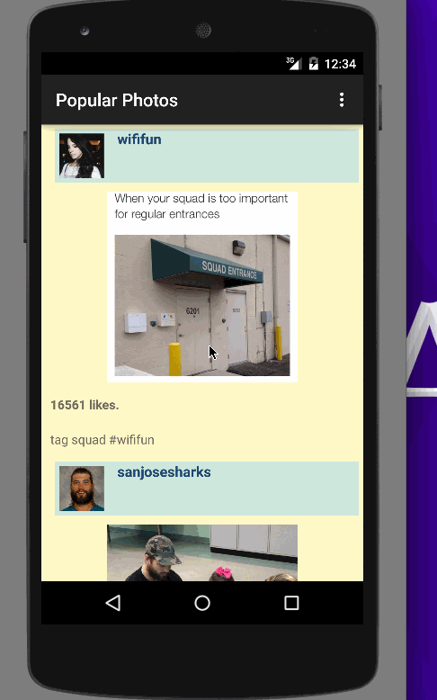

# InstagramPhotoViewer
A read-only photo viewer for Instagram which allows a user to check out popular photos.
Completed user stories:
- Required: User can scroll through current popular photos from Instagram
- Required: For each photo displayed, user can see the following details- Graphic, Caption, Username
- Optional: For each photo displayed, user can see the following details- like count, user profile image.

Walk through of user stories:

GIF created with [LiceCap](http://www.cockos.com/licecap/).
